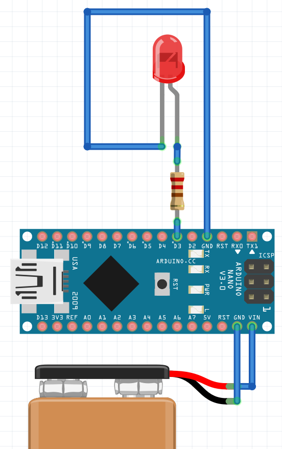

# Basic Arduino Tutorial
 
Arduinos are powerful and easily programmed devices that can enhance your foam dart blaster.

**Applications:**
 - Flywheelers 
 - HPA

**Functions**
 - Select fire
 - Brushless flywheels
 - Advanced fire control 
 

 
 
 
# Start here if you don't know what an Arduino is

## Arduino

It's a programmable microcontroller (MCU)

You will require both hardware and software

**Software**

(https://www.arduino.cc/)

This guide does not cover Arduino IDE setup, basic usage and language. Please go here for tutorials
(https://www.arduino.cc/en/Guide)

**Hardware**

Any Arduino Nano


Amazon
(https://www.amazon.com/Arduino-A000005-ARDUINO-Nano/dp/B0097AU5OU)

I like these low cost clones
Australia
(https://www.amazon.com.au/Arduino-Elegoo-ATmega328P-Without-Compatible/dp/B077272KMZ/)

## Basic Circuits

This is a basic button press LED circuit

### What are all these pins for?

An arduino has a number of pins connected to the MCU for a variety of uses. What you need to know are:


- Vin - Main power supply to the Arduino.
- GND - Ground
- 5V - 5VDC output supply. This can supply a max of about 500mA so do not attach motors and so on to it.
- D2 to D13 - Digital i/o pins. Configurable as an input or output. PWM on some pins. Use for on or off things like buttons, motors, etc
- A1 to A7 - Analogue i/o pins. Configurable as input or output. Use for things like battery monitors, adjustment potentiometers, etc
- The rest are not covered here

### Supply power to your Arduino

Arduino Nanos are 7-21VDC. 

Attach a power supply (eg batteries) to your Nano Vin and GND pins

!(/images/Battery.png)


### Input

Since we're programming nerf blasters, lets start with your basic requirement - an input switch that will cause the blaster to do something.
Your basic input circuit looks like this


Note the following
- One side of the button is connected to D2
- The other side is connected to GND

This means that when you press the button, D2 is connected to GND and reports back as LOW. If it is not pushed, it reports HIGH

*** SIDEBAR: Button Addressing ***
>There are several methods of addressing Arduino pins from code, but the short version is:
>
>Digital D2-D13:  D2 = 2, D3 = 3, etc
>
>Analog A0-A7:    A0 = A0, A1 = A1, etc


There are two INPUT definitions - INPUT and INPUT_PULLUP. The short version for our purposes are, INPUT_PULLUP works better in high EMF noise environments. 

You can add this to your code with the following

```
pinMode(9, INPUT_PULLUP);
if (digitalRead(9) == LOW)
{
	// Do something
}
```


### Output

Define your output like this
`pinMode(3, OUTPUT);`



If you set your output HIGH, it turns ON. LOW turns OFF.
Write to your output like this
`digitalWrite(3,HIGH);`


### Putting it together

Put the two together, and you get an LED turning on when the button is pressed


```
pinMode(9, INPUT_PULLUP);		// Input button
pinMode(3, OUTPUT);				// Output LED
if (digitalRead(9) == LOW)		// If button has been pressed
{
	digitalWrite(3,HIGH);		// Turn ON
}
else							// If button is not pressed
{
	digitalWrite(3,LOW);		// Turn OFF
}
```

### How does this relate to my flywheeler? I don't have LEDs!!

Swap out the LED with a circuit to drive the motors!

HOWEVER

The Arduino does not have the output voltage or current to drive DC motors. You need to use a power transistor circuit.

### Power MOSFET circuit

Go here for a complete guide on MOSFETs
(https://www.reddit.com/r/Nerf/comments/6ufmm8/the_complete_nerf_blaster_mosfet_wiring_tutorial/)

A transistor is essentially an electronically controlled switch - send a signal on the control pin to switch it ON and OFF.

You need:
- MOSFET (eg IRLB3034PBF)
- 10kohm Resistor
- Flyback Diode

Using the same inputs on the Arduino...


You can also use premade modules, especially for lower power requirements. For example, for the pusher electronics, I like the Freetronics NDRIVE N-MOSFET module. This has a 20A max rating and is relatively compact, so easy to drop in.

(https://www.freetronics.com.au/products/n-mosfet-driver-output-module)

Program code for this is the same as for the LED circuit. All we have done is replaced the LED.


### Adding a pusher driver and a rev trigger

To add an automatic pusher to the circuit, I've simply duplicated the power transistor circuit and added a solenoid. This has been connected to an available digital pin, D4. The solenoid should be powered on to push forward, then turn off to retract.

I have also added another button to D8. This could be used to trigger the pusher circuit.


The following code has the pusher logic added inside the rev wheels. 
Why?
To prevent jams (in a very crude fashion), we only want the pusher to run when the flywheels are running.

```
pinMode(9, INPUT_PULLUP);		// REV button
pinMode(8, INPUT_PULLUP);		// PUSH button
pinMode(3, OUTPUT);			// Output REV wheels
pinMode(4, OUTPUT);			// Output PUSH motor
if (digitalRead(9) == LOW)		// If button has been pressed
{
	digitalWrite(3,HIGH);		// Turn ON
	if (digitalRead(8) == LOW)		// If the rev is pressed, then we can press pusher)
	{
		digitalWrite(4,HIGH);		// Start pusher
		delay (100);					// energise for 100ms
		digitalWrite(4,LOW);		// Turn OFF pusher
		delay (100);					// denergise for 100ms
	}
}
else					// If REV button is not pressed, stop 
{
	digitalWrite(3,LOW);		// Turn OFF rev

}
```


## Troubleshooting

### My buttons aren't working

Electric motors, such as those used in Nerf flywheelers produce a fair bit of electromagnetic frequency noise (EMF). This, if close enough to your input wires, can induce current on them and mess with your input buttons and so on. Arduinos provide an internal "Pullup" resistor on its digital inputs which can block this from happening. Define your pin with INPUT_PULLUP instead.

`pinMode(9, INPUT_PULLUP);`

If its an extremely noisy environment, use an external resistor. These fare better when the switch is in close proximity to DC motors. 

10Kohm is a good resistance to start with. Noisier environments will require lower values.


## Basics covered

[The next section covers putting code together](ArduinoProgramming.md)

[Or skip to blaster configuration](BlasterTypes.md)
